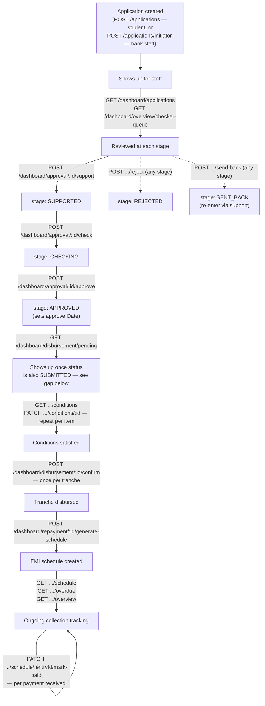
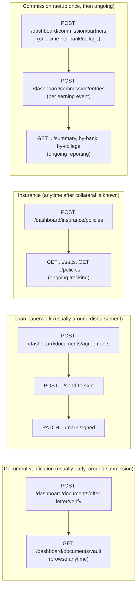

# Dashboard API — End-to-End Flow

Shows the order things happen in across a loan's life and which API call fires at
each step. Screen-by-screen endpoint reference is in `README.md`, this file is about
sequence.

## The main lifecycle

### Walking through it

1. Application created. Two paths now exist side by side: `POST /applications`
   (student self-submission, existing flow) and `POST /applications/initiator`
   (bank staff/relationship officer entering it directly after a field visit, no
   pre-existing ID needed — matches the mockup's flow). Both produce a
   `LoanApplication` with `stage: null` until someone acts on it.
2. Initiator/staff opens it. `GET /dashboard/applications` (the list) or
   `GET /dashboard/overview/checker-queue` (applications at `stage: SUPPORTED`
   awaiting a Credit Manager) to find it, then the four read-only
   `GET /dashboard/approval/:id/...` calls to review it.
3. Approval decision — now a real state machine. `POST /dashboard/approval/:id/support`
   → `check` → `approve` walk an application through `SUPPORTED` → `CHECKING` →
   `APPROVED`, each stamping the relevant sign-off date and writing an audit log
   entry; `reject` and `send-back` are available from any stage (`send-back` defaults
   to rewinding to `INITIATED`, and `support` can be called again from `SENT_BACK` to
   re-enter the pipeline). Each transition validates the current stage server-side
   and 400s on an invalid move (e.g. `approve` from anything but `CHECKING`).
   - `approve` is what finally sets `approverDate` — this used to be a dead field
     with nothing writing to it; it's live now.
   - Remaining gap: `approve` only touches `stage`/`approverDate`, it does not touch
     the separate `status` field (`DRAFT`/`SUBMITTED`). `GET /dashboard/disbursement/pending`
     still filters on `status: SUBMITTED` in addition to `approverDate`, so a bank
     staff-created application (via `POST /applications/initiator`) that reaches
     `stage: APPROVED` still won't appear there unless something also promotes its
     `status`. Nothing currently does that for the initiator path. See
     `DASHBOARD_STATUS.md`/README "Known gaps" for the open decision.
4. Conditions checklist. Once an application is approved (and, per the gap above,
   its `status` is `SUBMITTED`) it shows up in the disbursement queue. Staff loads
   `GET /dashboard/disbursement/:id/conditions` and ticks items off through
   `PATCH .../conditions/:conditionId` as each gets satisfied. Conditions can also be
   added ad hoc via `POST .../conditions`, the list isn't fixed.
5. Confirm disbursement. Once satisfied, `POST /dashboard/disbursement/:id/confirm`
   per tranche. This is additive, call it again for tranche 2, 3, and so on, and it
   creates the parent `Disbursement` record automatically on the first call.
6. Generate the EMI schedule. Trigger
   `POST /dashboard/repayment/:id/generate-schedule` right after the first
   disbursement gets confirmed. This is a deliberate manual trigger, not automatic,
   kept as a separate call on purpose so a partial/staged disbursement doesn't lock
   in a schedule prematurely.
7. Ongoing repayment tracking. `GET .../schedule` for the amortization table,
   `GET .../overdue?bucket=...` and `GET .../overview` for collections dashboards, and
   `PATCH .../schedule/:entryId/mark-paid` each time a payment comes in.

## Side flows

Not on the critical path above, don't block it and aren't blocked by it either:

- Document verification. `offer-letter/verify` is independent of everything
  else, do it whenever the college document arrives. The document vault
  (`GET /dashboard/documents/vault`) is just a read-only browse of everything
  uploaded for an application, at any stage.
- Loan agreements. `POST /dashboard/documents/agreements` creates a draft
  auto-populated from the application data, `send-to-sign` and `mark-signed` are two
  separate manual steps after that. No PDF/e-sign integration yet, these are just
  status flags, see `DASHBOARD_STATUS.md`.
- Insurance. A policy can be attached to an application any time once
  collateral/insurance details are known, it isn't gated by approval or disbursement.
- Commission. Needs a `CommissionPartner` (a bank or college MOU record) created
  once before you can log any `CommissionEntry` against it. After that, entries get
  created per earning event, typically per disbursement, though the two aren't
  currently linked automatically, see `README.md`.

## Always-on, not really a "flow" step

- Notifications (`GET /dashboard/notifications/log`) and the Audit ledger
  (`GET /dashboard/audit`) aren't things called in sequence, they're passive records
  of everything else happening above. Every mutation in every flow above writes an
  audit entry, so render these as live feeds rather than steps in a wizard.
- The Overview screen (`GET /dashboard/overview`) is a summary rollup of data
  from every flow above, it doesn't have its own sequence, just load it fresh
  whenever the landing page opens.
