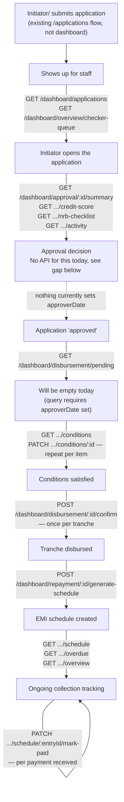
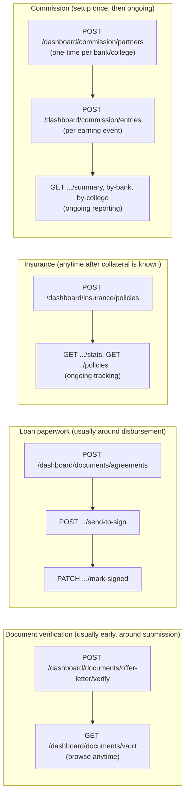

# Dashboard API — End-to-End Flow

Shows the order things happen in across a loan's life and which API call fires at
each step. Screen-by-screen endpoint reference is in `README.md`, this file is about
sequence.

## The main lifecycle

### Walking through it

1. Application initiated. In this mockup it's the Initiator (relationship
   officer/branch staff, e.g. "R. Bohara · RO" in the sample data) entering the
   application after a field visit, not a student self-service submission. The
   existing `/applications` module in this backend is actually a student-facing
   self-submission flow, a separate thing from this dashboard, so if the real
   product wants bank-staff-initiated applications the way the mockup shows, that's
   either a new creation path or the existing student flow gets reused with the
   Initiator acting on the borrower's behalf. Worth confirming which one before
   building it. Once status is `SUBMITTED` it becomes visible to staff either way.
2. Initiator opens it. `GET /dashboard/applications` (the list) or
   `GET /dashboard/overview/checker-queue` (the "needs action" feed) to find it, then
   the four read-only `GET /dashboard/approval/:id/...` calls to review it.
3. Approval decision, the missing link. There's currently no endpoint anywhere in
   the codebase, dashboard or otherwise, that sets `approverDate` on a
   `LoanApplication`. It's a real schema field, nothing writes to it. Practically:
   - The Overview's `pendingMyActionCount` and `approvalPipeline` counts stay stuck at
     their "nothing approved yet" values.
   - `GET /dashboard/disbursement/pending` filters on `approverDate: { not: null }`,
     so it will always return an empty list until this gets fixed.
   - This isn't specific to the dashboard, it's a gap in the app as a whole. Before
     the disbursement screen can show real data, something needs to write
     `approverDate`/`approverName`/`approverSignature`, most likely a new "approve
     application" endpoint. Explicitly out of scope for this pass, see
     `DASHBOARD_STATUS.md`.
4. Conditions checklist. Once an application is (hypothetically) approved it
   would show up in the disbursement queue. Staff loads
   `GET /dashboard/disbursement/:id/conditions` and ticks items off through
   `PATCH .../conditions/:conditionId` as each gets satisfied. Conditions can also be
   added ad hoc via `POST .../conditions`, the list isn't fixed.
5. Confirm disbursement. Once satisfied, `POST /dashboard/disbursement/:id/confirm`
   per tranche. This is additive, call it again for tranche 2, 3, and so on, and it
   creates the parent `Disbursement` record automatically on the first call.
6. Generate the EMI schedule. Trigger
   `POST /dashboard/repayment/:id/generate-schedule` right after the first
   disbursement gets confirmed. This is a deliberate manual trigger, not automatic,
   kept as a separate call on purpose so a partial/staged disbursement doesn't lock
   in a schedule prematurely.
7. Ongoing repayment tracking. `GET .../schedule` for the amortization table,
   `GET .../overdue?bucket=...` and `GET .../overview` for collections dashboards, and
   `PATCH .../schedule/:entryId/mark-paid` each time a payment comes in.

## Side flows

Not on the critical path above, don't block it and aren't blocked by it either:

- Document verification. `offer-letter/verify` is independent of everything
  else, do it whenever the college document arrives. The document vault
  (`GET /dashboard/documents/vault`) is just a read-only browse of everything
  uploaded for an application, at any stage.
- Loan agreements. `POST /dashboard/documents/agreements` creates a draft
  auto-populated from the application data, `send-to-sign` and `mark-signed` are two
  separate manual steps after that. No PDF/e-sign integration yet, these are just
  status flags, see `DASHBOARD_STATUS.md`.
- Insurance. A policy can be attached to an application any time once
  collateral/insurance details are known, it isn't gated by approval or disbursement.
- Commission. Needs a `CommissionPartner` (a bank or college MOU record) created
  once before you can log any `CommissionEntry` against it. After that, entries get
  created per earning event, typically per disbursement, though the two aren't
  currently linked automatically, see `README.md`.

## Always-on, not really a "flow" step

- Notifications (`GET /dashboard/notifications/log`) and the Audit ledger
  (`GET /dashboard/audit`) aren't things called in sequence, they're passive records
  of everything else happening above. Every mutation in every flow above writes an
  audit entry, so render these as live feeds rather than steps in a wizard.
- The Overview screen (`GET /dashboard/overview`) is a summary rollup of data
  from every flow above, it doesn't have its own sequence, just load it fresh
  whenever the landing page opens.
